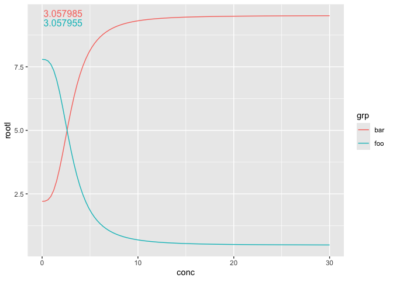
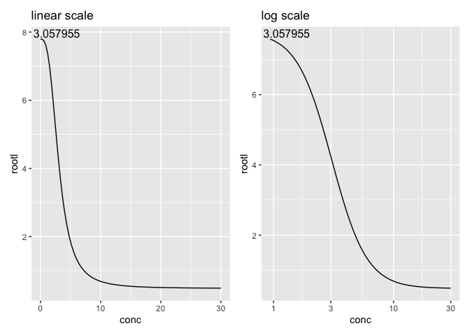
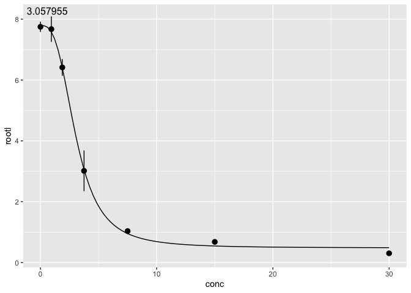

<!-- README.md is generated from README.Rmd. Please edit that file -->

# ggdose

<!-- badges: start -->

<!-- badges: end -->

ggdose provides a layer to calculate dose response relations in ggplot.
It relies on the
[drc](https://cran.r-project.org/web/packages/drc/index.html) package to
handle the math.

## Installation

You can install the development version of ggdose from
[GitHub](https://github.com/myuhao/ggdose) with:

``` r
devtools::install_github("myuhao/ggdose")
```

## Example

Use `geom_4PL()` in ggplot. It will plot the dose response curve for
you. The EC50 values will be plotted in the upper right corner.

``` r
library(ggdose)
#> Loading required package: drc
#> Loading required package: MASS
#> 
#> 'drc' has been loaded.
#> Please cite R and 'drc' if used for a publication,
#> for references type 'citation()' and 'citation('drc')'.
#> 
#> Attaching package: 'drc'
#> The following objects are masked from 'package:stats':
#> 
#>     gaussian, getInitial
#> Loading required package: ggplot2
#> Loading required package: dplyr
#> 
#> Attaching package: 'dplyr'
#> The following object is masked from 'package:MASS':
#> 
#>     select
#> The following objects are masked from 'package:stats':
#> 
#>     filter, lag
#> The following objects are masked from 'package:base':
#> 
#>     intersect, setdiff, setequal, union
#> Loading required package: magrittr
#> Loading required package: tidyr
#> 
#> Attaching package: 'tidyr'
#> The following object is masked from 'package:magrittr':
#> 
#>     extract
library(ggplot2)

drc::ryegrass |>
  ggplot(aes(x = conc, y = rootl)) +
  geom_4PL()
```


Within the same panel, different group (color/fill) will be treated
separately.

``` r
list(
  foo = drc::ryegrass,
  bar = dplyr::mutate(drc::ryegrass, rootl = 10 - rootl)
) |>
  dplyr::bind_rows(.id = "grp") |>
  ggplot(aes(x = conc, y = rootl)) +
  geom_4PL(aes(color = grp))
```



`geom_4PL()` ignore all transformation made with the x axis, such as
`scale_x_log10()`.

``` r

scale_1 = drc::ryegrass |>
  ggplot(aes(x = conc, y = rootl)) +
  geom_4PL() +
  labs(title = "linear scale")

scale_2 = drc::ryegrass |>
  ggplot(aes(x = conc, y = rootl)) +
  geom_4PL() + 
  scale_x_log10() +
  labs(title = "log scale")

patchwork::wrap_plots(scale_1, scale_2, ncol = 2)
```



`geom_4PL()` does not plot individual data point that are used for the
dose response relation. Use it in conjunction with other geom to achieve
the desired look.

``` r

drc::ryegrass |>
  ggplot(aes(x = conc, y = rootl)) +
  geom_pointrange(stat = StatSummary) +
  geom_4PL()
#> No summary function supplied, defaulting to `mean_se()`
```


